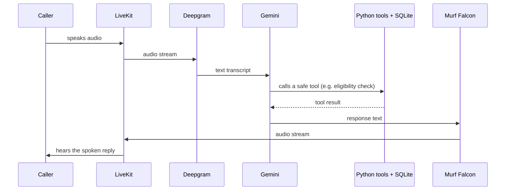
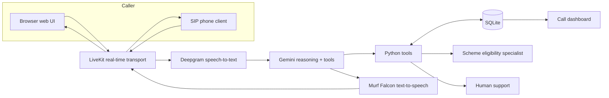

# ArthSakhi — Murf AI Voice for Bharat

ArthSakhi (अर्थसखी, "friend of money") is a voice-first financial-literacy assistant that helps people in India understand government financial schemes and safe digital-banking practices — simply by speaking.

[](https://opensource.org/licenses/MIT) [](https://www.python.org/) [](https://www.typescriptlang.org/) [](https://docs.livekit.io)
[](https://takshak.hashnode.dev/arthsakhi-building-a-voice-agent-that-knows-when-to-speak-act-and-ask-for-help)

This is a challenge/demo project, not a financial product. It shows how a conversational voice agent can be built responsibly around a sensitive, real-world domain: spoken financial guidance.

---

## Architecture at a glance

One conversation, from caller audio to spoken response:



LiveKit stays in the middle of every hop, so the caller never talks to Deepgram, Gemini, or Murf directly — only to the agent session that orchestrates them.

---

## Introduction

Many people learn about schemes such as PMJDY, PMSBY, PMJJBY, APY, and SSY from unverified sources. Reading a government portal or a dense application form is not practical while working — and is harder still if you are not fluent in the form's language.

ArthSakhi is for that moment: a caller speaks a question out loud and gets a short, plain-spoken answer with a clear source and a safe next step — in Hindi, Hinglish, or English, without jargon, and never by asking for an OTP, PIN, or account number.

---

## Why ArthSakhi?

- **Language.** The agent mirrors the caller's language — Hindi, Hinglish, or English — and switches the Murf voice when it detects Hindi/Hinglish speech.
- **Literacy and accessibility.** Callers need not read forms or navigate portals; they only speak and listen. Voice also helps low-vision and older users.
- **Simple spoken guidance.** Answers stay short and conversational, using respectful forms such as *aap* and *आप*.
- **Safety.** The agent is explicitly not a bank employee, officer, or advisor. It gives informational guidance and redirects account-specific, fraud, or approval questions to the official channel or a human.

---

## What it does

- **Real-time browser voice calls.** A Next.js frontend connects over LiveKit; speak, and the agent replies with Murf Falcon TTS.
- **Deepgram speech-to-text** (Nova-3, multilingual) transcribes the caller.
- **Google Gemini** reasons, follows the safety prompt, and calls only safe predefined tools.
- **Murf Falcon text-to-speech** (the project's real-time conversational TTS) uses the Indian English voice `Anisha` and switches Hindi/English variants.
- **Consent-aware caller memory.** Only non-sensitive facts (name, language, schemes discussed) may be remembered, and only after clear consent; sensitive keys are rejected at the storage layer.
- **Government-scheme eligibility guidance** for PMJDY, PMSBY, PMJJBY, APY, and SSY, from a local curated dataset, always labeled as guidance — not approval.
- **Human escalation with reference IDs.** For fraud or account-specific issues, a consent-based request stores only a short safe summary and returns an ID such as `ASH-2026-XXXX`.
- **Specialist handoff.** Scheme-specific questions transfer the same call to a second, narrower agent.
- **Outbound phone calls** via a LiveKit SIP trunk worker.
- **Local dashboards** for call outcomes and human-help requests, reading local SQLite.

---

## How it works



Audio flows in a loop: voice enters via LiveKit, is transcribed by Deepgram, reasoned over by Gemini, answered with safe Python tools and SQLite, and spoken back through Murf Falcon. Two optional paths branch off: scheme-specific questions transfer to the specialist agent, and fraud or account-specific issues can create a human-support request. The dashboard shows outcome counts from the same database.

---

## Core interaction flows

- **General financial-literacy question.** The main agent answers — no tools, no handoff.
- **Government-scheme eligibility.** The call is handed to the Government Scheme Eligibility Specialist, which asks one non-sensitive question at a time, runs the eligibility tool, and presents a dated, non-binding result with its source.
- **Human escalation.** For suspected fraud or account-specific issues, ArthSakhi reads a fixed consent statement and, only after clear consent, creates a support request with a short summary, what was checked, urgency, language, and follow-up method. The caller gets a reference ID; sensitive content is rejected.
- **Outbound reminder and opt-out.** An outbound SIP worker can place calls. Reminder scheduling and a stored do-not-call list are planned; today an opt-out request is acknowledged conversationally but not persisted.
- **Specialist handoff.** The main agent keeps the call open and swaps the in-call agent with `AgentSession.update_agent(...)` — no second call, no disconnect.
- **Call success/failure tracking.** Each agent writes a row to the `call_outcomes` table when a call starts and updates it when the session closes (`backend/src/call_recorder.py`); the dashboard aggregates total, successful, and failed calls from that table.

---

## Build your own voice agent

Every voice agent needs four building blocks; here is what each does and which technology this repo uses.

1. **Speech-to-text** converts speech into text. Here: **Deepgram** (`model="nova-3"`, multilingual).
2. **LLM** understands intent, reasons, and chooses tools. Here: **Google Gemini** via the LiveKit `google.LLM` plugin.
3. **Text-to-speech** converts the response back into natural audio. Here: **Murf Falcon** via `livekit-murf`, tuned for conversational pacing.
4. **Real-time transport** carries audio between caller and agent. Here: **LiveKit**, which also supplies voice-activity and turn detection.

These four pieces are wired together in one file, `backend/src/agent.py`, so the whole agent is easy to inspect and extend.

---

## Key implementation patterns

**Starting a LiveKit agent session** (`backend/src/agent.py`):

```python
session = AgentSession(
    stt=deepgram.STT(model="nova-3", language="multi"),
    llm=google.LLM(model="gemini-3.5-flash"),
    tts=murf.TTS(
        voice="Anisha",
        style="Conversation",
        tokenizer=tokenize.basic.SentenceTokenizer(min_sentence_len=2),
        text_pacing=True,
    ),
    turn_detection=MultilingualModel(),
    vad=ctx.proc.userdata["vad"],
)
await session.start(agent=assistant, room=ctx.room)
```

**Defining a voice-agent tool** — tools are plain methods decorated with `@function_tool`:

```python
@function_tool
async def check_scheme_eligibility(
    self,
    context: RunContext,
    scheme_id: str,
    answers: SchemeEligibilityAnswers,
) -> dict[str, Any]:
    return check_scheme_eligibility(scheme_id, dict(answers))
```

**Reading safe call-outcome metrics** — the dashboard aggregates the `call_outcomes` table (`backend/src/call_dashboard.py`). The agents write each outcome automatically via `backend/src/call_recorder.py`: a row is inserted when a call starts and finalized on the session's `close` event. The dashboard's query:

```sql
SELECT
    COUNT(*) AS total_calls,
    SUM(CASE WHEN outcome = 'success' THEN 1 ELSE 0 END) AS successful_calls,
    SUM(CASE WHEN outcome = 'failed' THEN 1 ELSE 0 END) AS failed_calls
FROM call_outcomes
```

**Handing off to the specialist agent** — a redacted context is built first, then the same call switches to the specialist:

```python
specialist = SchemeSpecialist(**safe_context)
await context.session.say(
    handoff_announcement(safe_context["language_preference"]),
    allow_interruptions=False,
)
context.session.update_agent(specialist)
```

None of the above involve API keys, secrets, phone numbers, or caller data — the agent works only with safe, non-sensitive inputs.

---

## Run locally

### Prerequisites

- **Python 3.10+** and **[uv](https://docs.astral.sh/uv/)**
- **Node.js 18+** and **pnpm** (`npm install -g pnpm`)
- A **LiveKit** project at [cloud.livekit.io](https://cloud.livekit.io/) (free tier), or the bundled `livekit-server.exe` for a local dev server
- API keys for **Murf**, **Deepgram**, and **Google Gemini**

### Repository setup

```bash
git clone https://github.com/icvbt/murf-livekit-starter.git
cd murf-livekit-starter
```

Copy `backend/.env.example` to `backend/.env.local` and `frontend/.env.example` to `frontend/.env.local`, then fill in your keys.

### Dependency installation

```bash
cd backend
uv sync
uv run python src/agent.py download-files   # first time only: VAD + turn-detector models

cd frontend
pnpm install
```

### Backend

```bash
cd backend
uv run python src/agent.py dev      # development (auto-reload)
uv run python src/agent.py console  # test the agent from the terminal, no UI
```

### Frontend

```bash
cd frontend
pnpm dev
```

### All-in-one (Windows)

From the repo root, run `.\start_app.ps1`. It starts LiveKit (if installed), the backend, and the frontend in separate PowerShell windows. (`start_app.sh` is the macOS/Linux equivalent.)

### Browser test URL

Open **http://localhost:3000**, allow microphone access, and click **Start conversation**. The backend agent must be running.

### Local dashboards

```bash
cd backend
uv run python src/call_dashboard.py        # call outcomes → http://localhost:8765
uv run python src/escalation_dashboard.py  # human-help requests → http://localhost:8765
```

Both dashboards default to port 8765, so run one at a time or change `PORT` in the file.

### SIP / outbound calls

Outbound calling works with a configured LiveKit SIP trunk:

```bash
cd backend
uv run python src/Telephony/outbound/agent.py dev
uv run python src/Telephony/outbound/dial.py --to +15551234567
```

The number must be E.164 format and one your SIP provider lets you call, and `LIVEKIT_SIP_OUTBOUND_TRUNK_ID` must be set. Inbound SIP (a phone or softphone such as Linphone calling into the agent) is documented in `backend/src/Telephony/Readme.md`, but the inbound agent code is not included in this repository.

---

## Environment variables and secrets

All secrets live in `.env.local` files that are already git-ignored (`.env.*` everywhere, and `backend/data/*.sqlite3`). **Never commit `.env` files.**

| Variable | Where | Purpose |
| --- | --- | --- |
| `LIVEKIT_URL` | backend + frontend | LiveKit server URL |
| `LIVEKIT_API_KEY` | backend + frontend | LiveKit API key |
| `LIVEKIT_API_SECRET` | backend + frontend | LiveKit API secret |
| `MURF_API_KEY` | backend | Murf Falcon TTS |
| `DEEPGRAM_API_KEY` | backend | Deepgram speech-to-text |
| `GOOGLE_API_KEY` | backend | Gemini LLM |
| `AGENT_NAME` | frontend (optional) | Explicit agent dispatch; backend registers `my-agent` |
| `LIVEKIT_SIP_OUTBOUND_TRUNK_ID` | backend | Outbound SIP trunk (outbound calls only) |
| `TRANSFER_TO_NUMBER` | backend (optional) | Human-transfer target for the outbound agent |
| `CALL_DB_PATH` | backend (optional) | Override for the call dashboard's SQLite path |

Never publish API keys, SIP credentials, phone numbers, caller data, OTPs, PINs, passwords, account numbers, government IDs, raw audio, or full transcripts. This repository contains none of these, and the storage layer rejects them by design.

---

## Try these conversations

Open the browser UI and speak:

1. **General question (main agent):** "What does financial literacy mean?"
2. **Scheme question (specialist handoff):** "Am I eligible for PMJDY? I am 24 and live in Karnataka."
3. **Fraud question (human support):** "I think I received a fraudulent banking message." Listen to the fixed consent statement, agree, and you should receive a reference ID.
4. **Opt-out request:** "Please don't call me again." Today the agent acknowledges this conversationally; a stored do-not-call list is a roadmap item.
5. **Ending before success:** disconnect or close the tab before the agent finishes. This exercises graceful shutdown; the call is recorded as failed.

---

## Testing and validation

```bash
cd backend
uv run python -m compileall src   # syntax check across the backend
uv run pytest                     # test suite
uv run ruff check .               # lint

cd frontend
pnpm lint
pnpm format:check
```

The pytest suite covers SQLite initialization, consent-gated memory (including rejection of sensitive keys and values), eligibility validation and result wording, escalation redaction, and specialist handoff behavior. Unit tests for memory, eligibility, and redaction run offline; the LLM-as-judge agent tests call a live judge model, so they need valid API keys, network access, and LiveKit credentials.

---

## Troubleshooting

- **LiveKit or API keys not loading.** The agent reads `.env.local` from the `backend/` directory. Confirm both `.env.local` files exist and restart the backend after editing. A typo in `LIVEKIT_URL` is the most common cause of silent connection failures.
- **Dashboard shows zero calls.** It reads `backend/data/arthsakhi.sqlite3`. If the agent runs from a different working directory, or you set `CALL_DB_PATH` elsewhere, the dashboard reads a different database. A fresh database also starts empty until calls actually run — outcomes are recorded when sessions start and close, and only non-empty `success`/`failed` rows are counted.
- **SIP/outbound connection failure.** Verify `LIVEKIT_SIP_OUTBOUND_TRUNK_ID` and that the trunk's credentials and caller ID are accepted by your provider. The worker logs the SIP status code on failure. Inbound SIP is not shipped.
- **Browser microphone permission failure.** The frontend detects and surfaces microphone errors. Check site permissions; mic access needs `localhost` or HTTPS (a secure context).
- **Specialist handoff API differences.** The handoff uses `AgentSession.update_agent(...)`, the API in `livekit-agents ~1.4` (pinned in `pyproject.toml`). Other versions differ.
- **Port already in use.** Both dashboards bind port 8765 and the frontend uses 3000. Change `PORT` in the dashboard script or free the port first.

---

## Privacy and responsible AI

- **Consent before memory, reminders, or escalation.** The agent never saves memory or creates a support request until the caller clearly agrees; ambiguity means no action.
- **Opt-out handling.** The agent acknowledges opt-out requests; a stored do-not-call list is planned.
- **No sensitive financial information.** OTPs, PINs, CVVs, passwords, card/account numbers, Aadhaar, and PAN are never stored, never passed to tools, and never included in summaries — enforced at the prompt, validation, and storage layers.
- **No unsupported claims.** The agent never claims approvals, refunds, blocked transactions, balances, or application status. Eligibility results are labeled "general guidance, not official approval" with their source and verification date.
- **Human support for issues AI should not decide.** Fraud and account-specific matters go to official channels or a consent-based human-support request.
- **Local SQLite and challenge-project limitations.** Data lives in a local SQLite file without encryption, authentication, or backup — fine for a local demo, not for production.

---

## Project status and next steps

**Implemented.** Browser voice conversations (LiveKit → Deepgram → Gemini → Murf Falcon), language-aware TTS, consent-based caller memory, scheme eligibility guidance, specialist handoff, human escalation with reference IDs, outbound SIP worker, automated call-outcome recording, call and human-help dashboards, and a passing test suite.

**Suitable for a local demo.** The browser conversation flow, eligibility guidance over the local curated dataset, the specialist handoff, and both dashboards.

---

## Links

- **Public repository:** https://github.com/icvbt/murf-livekit-starter
- **Day 10 blog post:** https://takshak.hashnode.dev/arthsakhi-building-a-voice-agent-that-knows-when-to-speak-act-and-ask-for-help
- **LinkedIn post:** https://www.linkedin.com/posts/icvbt_murfaivoiceagentschallenge-10daysofaivoiceagents-ugcPost-7494459755499769856-jV_J/
- **Underlying docs:** [LiveKit Agents](https://docs.livekit.io/agents) · [Murf Falcon TTS](https://murf.ai/api/docs/text-to-speech/streaming) · [Murf Voice Library](https://murf.ai/api/docs/voices-styles/voice-library) · [Deepgram](https://developers.deepgram.com)

---

## License

MIT — see [LICENSE](LICENSE).
